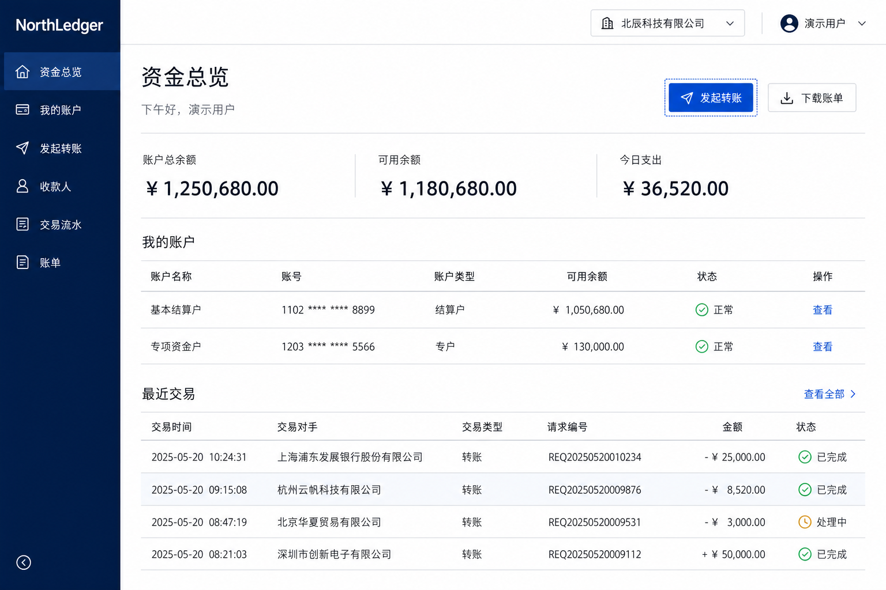

# NorthLedger

NorthLedger 是一个可真实运行的企业资金账户与交易平台。它以“开户 → 转账 → 余额变更 → 双边账务流水 → 安全审计”为业务主线，并把 Linux、Docker Compose、Kubernetes/Helm、MySQL、持续集成、监控告警、备份恢复、发布回滚和故障排查放在同一条交付链上。

这个项目的重点不是展示组件数量，而是回答三个企业项目问题：业务数据是否一致、每次操作是否可追溯、系统出现故障后能否定位和恢复。

## 已实现的完整闭环

### 业务闭环

- 创建资金账户，查询账号、户名、余额、币种和状态。
- 发起账户间转账，使用客户端请求号保证网络重试不会重复扣款。
- 在一个 MySQL 事务中完成余额校验、固定顺序加锁、余额更新、订单落库和借贷双边流水。
- 查询转账订单和对应流水，核对借方金额与贷方金额是否平衡。
- 运行总览聚合真实账户、真实交易和真实健康状态，不使用前端假数据。

### 身份与治理闭环

- 用户名和 BCrypt 密码哈希认证；仓库不保存可用登录密码。
- Spring Session JDBC 把会话保存在 MySQL，多副本 API 可共享登录状态。
- `ADMIN`、`OPERATOR`、`AUDITOR` 三类职责按最小权限访问接口。
- 所有修改请求执行 CSRF 校验；未登录返回 401，越权返回 403。
- 登录成功、登录失败、退出、越权和用户创建写入不可变审计事件。
- 前端菜单按角色呈现，但最终授权始终由 Spring Security 在服务端执行。

### 运维闭环

- Docker 多阶段构建、非 root 运行、健康检查、只读文件系统和 Compose 编排。
- Nginx 统一入口、安全响应头、请求追踪号、登录限流和 Actuator 隔离。
- Prometheus、Grafana、Alertmanager、Loki、Alloy、Node Exporter、cAdvisor 组成指标、日志和告警链路。
- Helm 管理 Deployment、Service、Ingress、探针、HPA、PDB、RBAC、NetworkPolicy 和 MySQL PVC 实验环境。
- Linux 原生路径包含 systemd、Nginx、SELinux、firewalld、logrotate、巡检、诊断、发布和自动回滚脚本。
- MySQL 备份恢复、故障注入、首响排查和复盘模板形成恢复证据。

## 界面方向

NorthLedger 采用企业资金平台常见的深海军蓝导航、白色业务画布、表格主导布局。它不是“运维工具大屏”，而是一个业务平台；运维能力通过运行页面、真实指标、日志、告警和部署证据体现。



## 请求与数据链路

```text
浏览器
  │  SESSION(HttpOnly) + XSRF-TOKEN/Header
  ▼
Nginx :18000
  ├─ React 静态资源
  ├─ /api → Spring Boot :18080
  └─ /health → readiness
                 │
                 ├─ Spring Security / RBAC / Audit
                 ├─ Account / Transfer / Ledger
                 └─ MySQL :3306

Spring Boot / Host / Container ──指标──▶ Prometheus ──▶ Grafana / Alertmanager
Application / Container ─────────日志──▶ Alloy ──▶ Loki ──▶ Grafana
```

## 模块边界

| 模块 | 负责什么 | 不负责什么 |
| --- | --- | --- |
| `identity` | 用户、角色、状态、密码哈希、首个管理员 | 账户余额和交易规则 |
| `security` | 认证过滤链、会话、CSRF、401/403 | 业务数据判断 |
| `audit` | 安全与管理操作证据、按权限查询 | 修改历史事件 |
| `account` | 开户、余额、账户状态 | 认证实现 |
| `transfer` | 幂等、并发锁、事务、订单和双录流水 | 用户管理 |
| `dashboard` | 组合业务与运行读模型 | 写资金数据 |
| `observability` | traceId、指标和结构化日志 | 保存业务事实 |

继续采用模块化单体：当前账户、转账和流水属于同一事务边界，一个可部署单元更容易保证一致性。只有模块出现独立发布、独立扩缩容或不同可用性目标时，才有充分理由拆成微服务。

## 技术栈

| 层次 | 技术 |
| --- | --- |
| 后端 | Java 17、Spring Boot 3.5、Spring MVC、Validation、JPA/Hibernate、Spring Security、Spring Session JDBC |
| 数据 | MySQL 8.4、Flyway、悲观锁、唯一约束、`DECIMAL`、双录流水 |
| 测试 | JUnit 5、MockMvc、Spring Security Test、Testcontainers MySQL |
| 前端 | React 18、TypeScript、Vite、React Router、Lucide、响应式 CSS |
| 入口与交付 | Nginx、Docker、Docker Compose、GitHub Actions |
| Kubernetes | Helm、Deployment、Service、Ingress、StatefulSet/PVC、HPA、PDB、RBAC、NetworkPolicy |
| 可观测性 | Actuator、Micrometer、Prometheus、Grafana、Alertmanager、Loki、Alloy |
| Linux 运维 | Rocky Linux、systemd、firewalld、SELinux、logrotate、Bash、PowerShell |

项目没有加入 Redis、Kafka、Milvus、Service Mesh 或多集群。当前业务没有需要它们解决的真实问题，引入只会扩大不可解释的技术面。

## 本地完整启动

要求：Docker Desktop 已启动，宿主机安装 Java 17、Maven 和 Node.js。

```powershell
Copy-Item .env.example .env
# 编辑 .env，为数据库、首个管理员和 Grafana 设置仅供本机使用的密码
powershell -ExecutionPolicy Bypass -File scripts/start-local.ps1 -WithObservability -RunTests
```

启动脚本会依次运行真实 MySQL 测试、前端生产构建、镜像构建、Compose 启动和 Nginx 健康门禁。首次数据库为空时，使用 `.env` 中的 `BOOTSTRAP_ADMIN_USERNAME` 和 `BOOTSTRAP_ADMIN_PASSWORD` 登录。

| 入口 | 地址 | 用途 |
| --- | --- | --- |
| NorthLedger | <http://localhost:18000> | 业务平台统一入口 |
| readiness | <http://localhost:18000/health> | 判断实例能否接收请求 |
| Grafana | <http://localhost:13000> | 指标和日志看板 |
| Prometheus | <http://localhost:19090> | 指标查询与 Targets |
| Alertmanager | <http://localhost:19093> | 告警分组、静默和恢复状态 |
| Loki readiness | <http://localhost:13100/ready> | 日志存储就绪检查 |

## 在 IDEA 中运行后端

1. 用 IDEA 打开项目根目录并选择 Java 17。
2. 先让 MySQL 可用；可以只启动 Compose 中的 `mysql` 服务。
3. 在运行配置中提供 `DB_PASSWORD`，以及首次空库所需的 `BOOTSTRAP_ADMIN_USERNAME`、`BOOTSTRAP_ADMIN_PASSWORD`。
4. 运行 `com.opspilot.OpsPilotApplication`；后端监听 `18080`。
5. 前端开发模式在 `frontend` 目录执行 `npm run dev`；完整同源认证建议优先使用 Compose 的 `18000` 入口。

密码没有源码默认值，这是为了让“开发方便”不会意外变成“部署后仍使用公开密码”。

## Kubernetes/Helm 实践

要求：Docker Desktop、Minikube、kubectl 和 Helm。

```powershell
powershell -ExecutionPolicy Bypass -File scripts/k8s/deploy-minikube.ps1
kubectl -n opspilot port-forward service/opspilot-web 18000:8080
powershell -ExecutionPolicy Bypass -File scripts/k8s/smoke-test.ps1
```

Helm values 中的数据库和引导管理员密码默认为空，部署时必须通过受控 Secret 或命令行临时值提供。教学用 MySQL StatefulSet 用于练习 PVC、探针、备份与恢复；生产示例会关闭内置数据库并连接外部高可用 MySQL。

详细边界见 [Kubernetes 交付说明](deploy/k8s/README.md) 与 [生产边界](docs/architecture/kubernetes-production-boundary.md)。

## 验证命令

```powershell
mvn -B -ntp test
Set-Location frontend
npm ci --ignore-scripts
npm audit --audit-level=high
npm run build
Set-Location ..
docker compose -f compose.yml -f compose.local.yml config
helm lint deploy/k8s/helm/opspilot `
  --set-string secrets.databasePassword=test-database-password `
  --set-string secrets.mysqlRootPassword=test-root-password `
  --set-string secrets.bootstrapAdminPassword=test-bootstrap-password
```

持续集成执行同一组后端测试、前端依赖门禁、前端生产构建、Helm 校验和 API/Web 镜像构建。

## 推荐阅读顺序

1. [平台架构与企业级边界](docs/architecture/enterprise-platform-upgrade-spec.md)
2. [认证、权限和审计 Runbook](docs/runbooks/authentication-and-access.md)
3. [Docker Compose 运行手册](docs/runbooks/docker-compose.md)
4. [Linux 原生部署](docs/runbooks/linux-deployment.md)
5. [MySQL 备份恢复](docs/runbooks/mysql-backup-restore.md)
6. [第一响应排障](docs/troubleshooting/first-response.md)
7. [个人学习与复述路线](docs/learning-notes/northledger-learning-route.md)
8. [依赖安全审计](docs/security/dependency-audit.md)

## 目录结构

```text
src/main/java/                 后端业务、安全、审计和观测代码
src/main/resources/db/        只追加的 Flyway 数据库迁移
src/test/                      单元测试和真实 MySQL 集成测试
frontend/                      React/TypeScript 业务门户
deploy/docker/                 容器入口与 Nginx
deploy/linux/                  systemd、Nginx、环境和 logrotate
deploy/k8s/helm/opspilot/      Kubernetes Helm Chart
observability/                 Prometheus、Grafana、日志与告警配置
scripts/                       构建、发布、回滚、备份、巡检和演练
docs/                          架构、Runbook、学习与故障材料
.github/workflows/             持续集成门禁
```

## 简历可陈述边界

可以基于真实代码和验证结果说明：完成资金账户、幂等转账和双录流水业务闭环；使用 Spring Security、MySQL 会话和 RBAC 建立访问控制；使用 Docker Compose 与 Helm 交付；通过指标、日志、告警、备份恢复和发布回滚形成运维闭环。

不应把单机 MySQL/Minikube 描述成生产高可用集群，也不应在未亲自复现前把配置文件等同于熟练掌握。建议按“能解释原理 → 能独立启动 → 能制造并排除故障 → 能脱离文档复述”的顺序完成个人验收。
