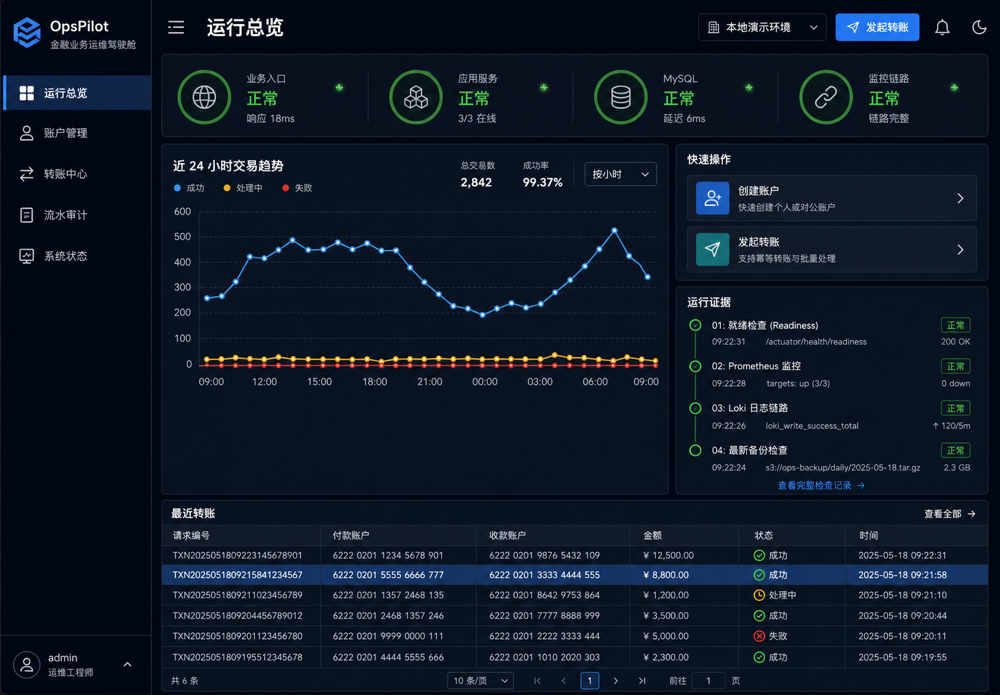
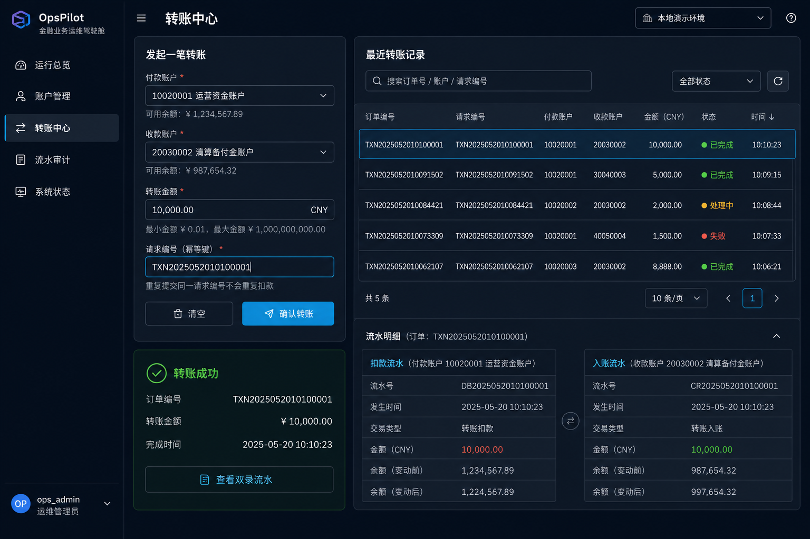

# OpsPilot 云原生运维与交付平台

OpsPilot 是一个以金融账户、转账和双录流水为业务载体的运维开发与云原生发布项目。它面向央国企运维岗、银行科技岗及私企 DevOps/SRE 岗位，目标不是堆组件，而是证明一条可运行、可观测、可发布、可回滚、可排障、可恢复、可审计的完整链路。

## 项目亮点

- 真实业务闭环：开户、账户查询、转账、幂等重放、订单查询、借贷流水和平衡校验。
- 事务与并发：MySQL 单事务、悲观锁固定顺序、锁后幂等双检、唯一约束、失败整体回滚。
- 完整业务前端：React + TypeScript + Vite 运维驾驶舱，所有列表和指标来自真实 API/MySQL。
- 容器与 Linux：多阶段构建、非 root、只读根文件系统、Compose、systemd、Nginx、logrotate 和自动化脚本。
- Kubernetes/Helm：双副本滚动发布、三类探针、HPA、PDB、RBAC、NetworkPolicy、StatefulSet/PVC、发布和回滚。
- 可观测性：Prometheus、Grafana、Alertmanager、Loki、Alloy、Node Exporter、cAdvisor。
- 生产保障：MySQL 备份恢复、巡检、故障注入、诊断包、Runbook、排障案例和复盘模板。

## 界面预览

### 运行总览



### 转账与双录流水



## 总体架构

```text
浏览器
  → Nginx :18000 / Kubernetes Ingress
  → React 静态控制台
  → /api 反向代理
  → Spring Boot :18080
  → MySQL :3306

Spring Boot → Actuator/Micrometer → Prometheus → Alertmanager
容器/应用日志 → Alloy → Loki → Grafana
Linux/容器指标 → Node Exporter/cAdvisor → Prometheus → Grafana
```

Compose 使用 10 个核心与观测服务完成单机闭环；Kubernetes 使用相同 API/Web 镜像，通过 Helm 交付业务工作负载。

## 技术栈

| 层次 | 技术 |
| --- | --- |
| 后端 | Java 17、Spring Boot 3.5、Spring MVC、Validation、JPA/Hibernate |
| 数据 | MySQL 8.4、Flyway、悲观锁、DECIMAL、双录流水 |
| 测试 | JUnit 5、MockMvc、Testcontainers MySQL |
| 前端 | React 18、TypeScript、Vite、Lucide、响应式 CSS、原生 SVG 图表 |
| 入口 | Nginx、请求 ID、Actuator 隔离、安全响应头 |
| 容器 | Docker 多阶段构建、Docker Compose、非 root、只读文件系统 |
| Kubernetes | Helm、Deployment、Service、Ingress、StatefulSet/PVC、HPA、PDB、RBAC、NetworkPolicy |
| 可观测性 | Actuator、Micrometer、Prometheus、Grafana、Alertmanager、Loki、Alloy |
| 主机运维 | Rocky Linux、systemd、firewalld、SELinux、logrotate、Bash、PowerShell |

## 快速启动：Docker Compose

要求：Java 17、Maven、Node.js、Docker Desktop。

```powershell
Copy-Item .env.example .env
powershell -ExecutionPolicy Bypass -File scripts/start-local.ps1 -WithObservability -RunTests
```

启动后访问：

| 服务 | 地址 |
| --- | --- |
| React 业务控制台 / Nginx 统一入口 | <http://localhost:18000> |
| readiness | <http://localhost:18000/health> |
| Spring Boot 直连诊断 | <http://localhost:18080> |
| Grafana | <http://localhost:13000> |
| Prometheus | <http://localhost:19090> |
| Alertmanager | <http://localhost:19093> |
| Loki readiness | <http://localhost:13100/ready> |

## 快速启动：Kubernetes

要求：Docker Desktop、Minikube、kubectl、Helm。

```powershell
powershell -ExecutionPolicy Bypass -File scripts/k8s/deploy-minikube.ps1
kubectl -n opspilot port-forward service/opspilot-web 18000:8080
powershell -ExecutionPolicy Bypass -File scripts/k8s/smoke-test.ps1
```

发布新版本和回滚：

```powershell
powershell -ExecutionPolicy Bypass -File scripts/k8s/deploy-minikube.ps1 -Version 0.1.1
powershell -ExecutionPolicy Bypass -File scripts/k8s/rollback.ps1
```

详细说明见 [Kubernetes 交付](deploy/k8s/README.md) 和 [生产边界](docs/architecture/kubernetes-production-boundary.md)。

## 目录边界

```text
src/                          Java 业务、读模型和真实 MySQL 测试
frontend/                     React/TypeScript 业务与运维控制台
deploy/docker/                容器入口配置
deploy/linux/                 systemd、Nginx、环境变量、logrotate
deploy/k8s/helm/opspilot/     Kubernetes Helm Chart
observability/                指标、日志、告警和 Grafana 看板
scripts/                      构建、发布、回滚、备份、巡检、故障演练
docs/                         架构、Runbook、学习、排障和验收材料
```

## 关键文档

- [阶段验收报告](docs/acceptance-report.md)
- [模块边界](docs/architecture/module-boundaries.md)
- [Kubernetes 企业级边界](docs/architecture/kubernetes-production-boundary.md)
- [Docker Compose Runbook](docs/runbooks/docker-compose.md)
- [Linux 原生部署](docs/runbooks/linux-deployment.md)
- [MySQL 备份恢复](docs/runbooks/mysql-backup-restore.md)
- [第一响应排障](docs/troubleshooting/first-response.md)
- [Kubernetes 学习入口](docs/learning-notes/phase-2-kubernetes/README.md)

## 技术选择边界

当前保持模块化单体，因为个人项目的账户、转账和审计仍属于同一业务边界；拆微服务会引入分布式事务与运维复杂度，却没有真实团队/扩缩容收益。

本地 MySQL StatefulSet 用于学习 PVC、探针、备份和恢复，不宣称生产高可用；类生产 values 会关闭它并连接外部托管数据库。

项目暂不加入 Redis、Kafka、Milvus、Service Mesh、Operator 和多集群。只有出现缓存、事件解耦、语义检索或复杂流量治理等明确需求时才演进，避免把简历项目做成无法解释的组件清单。
